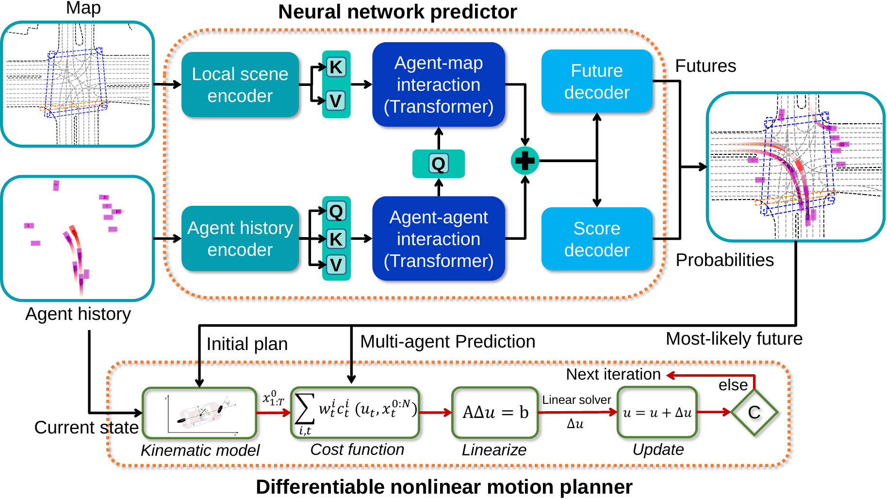

# Differentiable Integrated Multi-agent Prediction and Motion Planning Framework with Learnable Cost Function for Autonomous Driving

[Zhiyu Huang](https://mczhi.github.io/), Haochen Liu, [Jingda Wu](https://wujingda.github.io/), [Chen Lv](https://scholar.google.com/citations?user=UKVs2CEAAAAJ&hl=en) 

[AutoMan Research Lab, Nanyang Technological University](https://lvchen.wixsite.com/automan)

## Abstract

Predicting the future states of surrounding traffic participants and planning a safe, smooth, and socially compliant trajectory accordingly is crucial for autonomous vehicles. However, there are two major issues with the current autonomous driving system: the prediction module is often decoupled from the planning module and the cost function for planning is hard to specify and tune. Therefore, we propose an end-to-end differentiable framework that integrates prediction and planning modules and is able to learn the cost function from data. Specifically, we employ a differentiable nonlinear optimizer as the motion planner, which takes as input the predicted trajectories of surrounding agents given by the neural network and optimizes the trajectory for the autonomous vehicle, thus enabling all operations in the framework to be differentiable including the cost function weights. The proposed framework is trained on a large-scale real-world driving dataset with the objective to reproduce human driving trajectories in the entire driving scene and tested in both open-loop and closed-loop manners. The results reveal that the proposed method outperforms the baseline methods, especially in the closed-loop test where the baseline methods suffer from distributional shifts. We also demonstrate that our proposed method delivers planning-aware prediction results, allowing the planning module to output close-to-human trajectories.

## Method Overview
The proposed framework consists of two parts. First, we build up a holistic neural network to embed the history states of agents and scene context into high-dimensional spaces, encode the interactions between agents and the scene context using Transformer modules, and finally decode different future predicted trajectories and their probabilities. Second, we employ a differentiable optimizer as a motion planner to explicitly plan a future trajectory for the AV according to the most-likely prediction result and initial motion plan. Since the motion planner is differentiable, the gradient from the planner can be backpropagated to the prediction module and the cost function weights can also be learned with the objective to imitate human driving trajectories.

## Results

### Unprotected left turn

| <video muted controls width=380> <source src="./src/41b679612fa714aa.mp4"  type="video/mp4"> </video> | <video muted controls width=380> <source src="./src/96a9bc8c1242ee5d.mp4"  type="video/mp4"> </video> |

## Contact

If you have any questions, feel free to contact us (zhiyu001@e.ntu.edu.sg).
